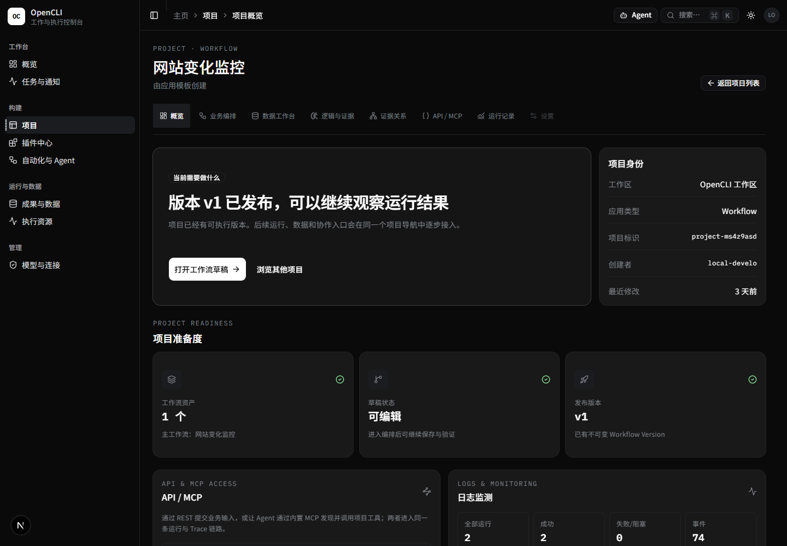
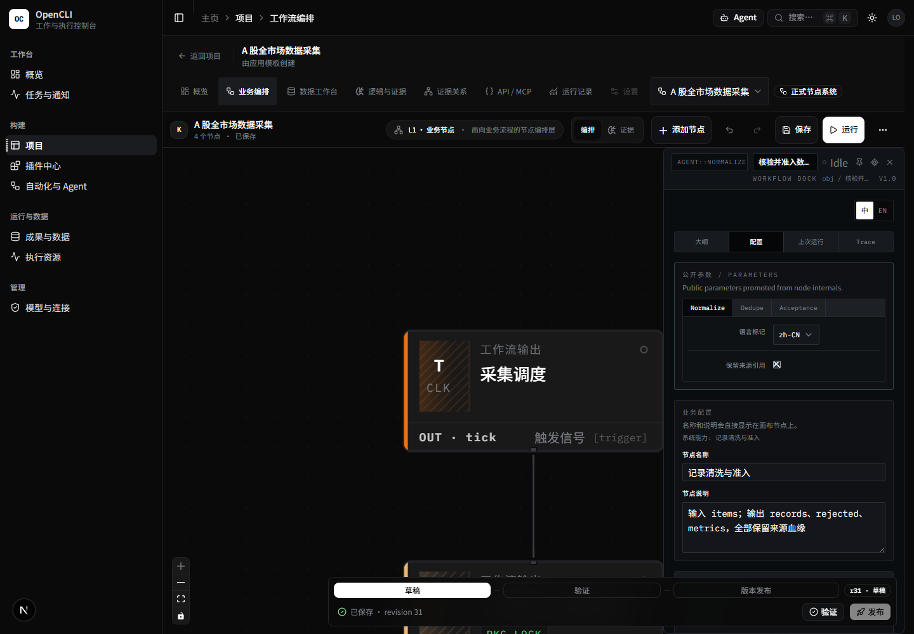
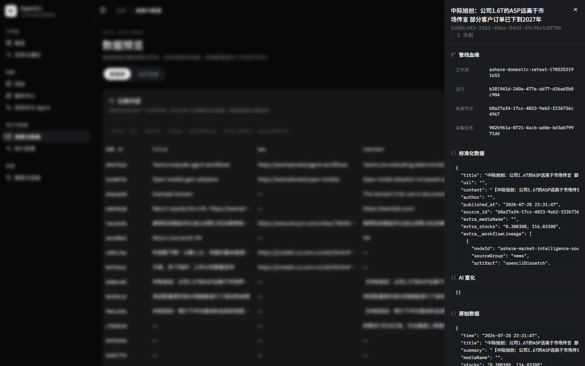
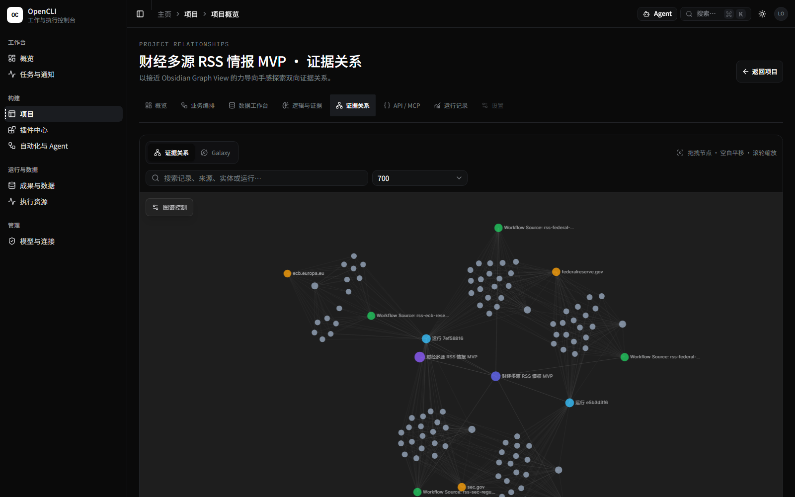
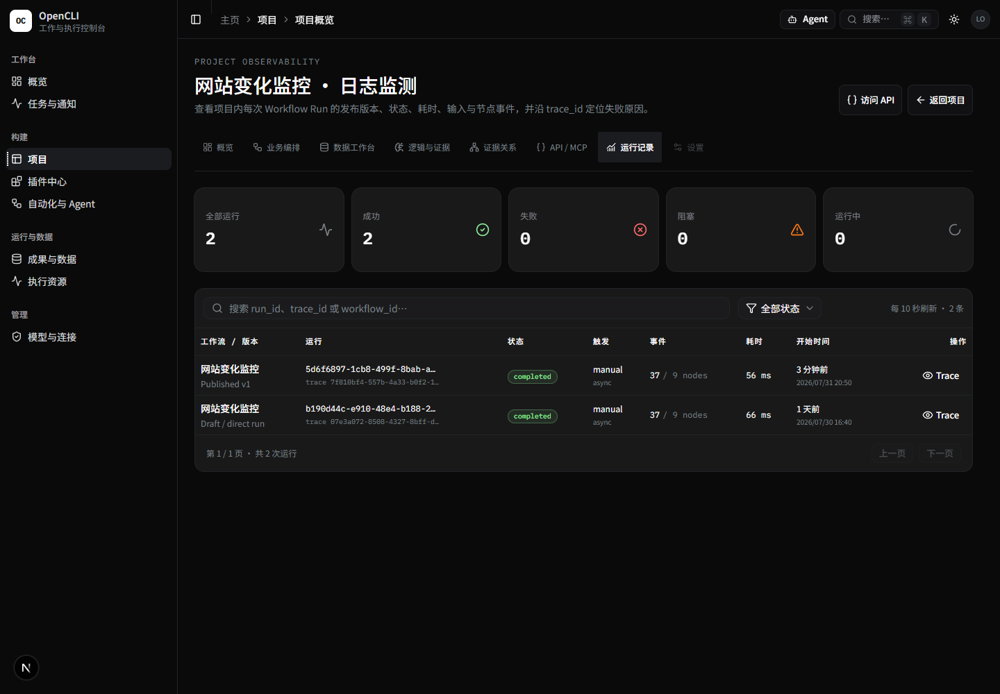

# OpenCLI Admin

开源、自托管的研究与情报管线。把浏览器 / OpenCLI / RSS / API 数据采集、可视化工作流、AI 处理、证据关系和结果交付放进一个可运行、可审计的系统。

  

图中的网站变化监控项目已发布不可变 <code>v1</code>，并完成了基于该发布版本的真实运行与 Trace 记录。

当前公开版本 <strong>v0.4.0</strong> 已打通：

<strong>登录采集账号 → 创建研究项目 → 编排工作流 → 执行与追踪 → 查看记录和证据 → 定时运行 / 对外交付</strong>

## 一条命令启动

前置要求：Docker 与 Docker Compose。

Linux / macOS：

~~~bash
curl -fsSL https://raw.githubusercontent.com/2233admin/opencli-admin/v0.4.0/scripts/install.sh | sh
~~~

Windows PowerShell：

~~~powershell
Invoke-WebRequest https://raw.githubusercontent.com/2233admin/opencli-admin/v0.4.0/scripts/install.ps1 -OutFile install.ps1
.\install.ps1
~~~

安装器会生成安全密钥、拉取公开的多架构 GHCR 镜像、启动服务并等待健康检查通过。

| 入口 | 地址 | 用途 |
| --- | --- | --- |
| 管理界面 | http://localhost:3010 | 项目、工作流、运行和数据 |
| API 文档 | http://localhost:8031/docs | REST API 与集成调试 |
| 内置浏览器 | http://localhost:6080 | 扫码或登录需要账号的平台 |

安装完成后，终端会打印：

- <code>BOOTSTRAP_ADMIN_TOKEN</code>：首次进入管理界面使用；
- <code>API_AUTH_TOKEN</code>：Fleet、Agent、API 和 MCP 访问使用。

两者同时保存在安装目录的 <code>.env</code>。不要公开 noVNC、令牌或浏览器调试端口；远程部署建议使用 HTTPS、反向代理或 SSH 隧道。

## 正常的研究流程

1. 打开 <code>:6080</code>，在内置 Chromium 中扫码或登录目标平台。公开 RSS、API 和网页来源可跳过这一步。
2. 在「插件中心」确认 OpenCLI、RSS、API 或工具能力，在「项目」中从模板或空白项目开始。
3. 在 Dify 风格的画布中连接来源、处理、Agent、Gate 和交付节点；右侧参数面板配置当前节点实际声明的业务参数。
4. 保存、验证并发布工作流，手动执行已发布版本；Webhook 也可直接提交 <code>workflowProject</code> 触发运行。
5. 在运行记录中查看节点事件、Trace、错误、重试和输出；采集结果统一进入「成果与数据」。
6. 在项目内查看数据、逻辑与证据、证据关系和 Galaxy 视图。Galaxy 是证据关系的一种查看方式，不是独立的项目模块。
7. 配置 Webhook、飞书、钉钉、企业微信或 Email，将通过规则和质量门的数据交付出去。

## 产品界面

### 可视化工作流

来源、处理、校验和数据集节点在同一画布完成编排；草稿、验证、发布和运行使用同一项目上下文。

### 统一数据结果

采集结果保留原始数据、标准化字段和完整血缘，可搜索、查看详情，也可继续进入 AI、关系分析和交付节点。

### 证据与关系

项目证据、实体关系和 Galaxy 共用同一份项目数据，支持搜索、图谱控制和运行证据回溯。

### 运行与治理

每次运行都能看到发布版本、状态、触发方式、节点事件、耗时和 Trace；下图第一条记录即为 <code>Published v1</code> 的成功运行。

## 已支持的能力

| 层次 | 能力 |
| --- | --- |
| 项目与工作流 | 项目模板、可视化节点编排、草稿、验证、版本发布、运行记录 |
| 数据采集 | OpenCLI 浏览器适配、RSS、REST API、网页抓取、CLI / 工具节点 |
| 登录态 | Docker 内置 Chromium + noVNC；Bridge / CDP；浏览器 Profile 持久化 |
| 处理与分析 | 归一化、去重、AI 摘要 / 标签、关系与证据视图、Kats 时序工具（可选运行时） |
| 自动化 | 已发布版本手动执行、Webhook ingress、节点级事件、重试与可观测 Trace |
| 交付 | Webhook、飞书、钉钉、企业微信、Email，以及 API / MCP 消费 |
| 执行资源 | 单机内置浏览器执行资源；可选远程 Agent、WS 反向通道、HTTP 直连与按站点路由 |

OpenCLI 提供小红书、Bilibili、知乎、微博、X / Twitter、Reddit、YouTube、LinkedIn、Hacker News、财经和公开内容等适配能力。实际可用性取决于上游适配器、地区、登录态、站点风控和页面变更；请在自己的账号与网络环境中先运行连接测试。

## 默认、需配置与可选能力

| 开箱即用 | 配置后可用 | 可选部署 |
| --- | --- | --- |
| 项目 / 工作流 Studio | 需要登录的平台采集 | 远程多机 Agent |
| SQLite 数据库 | 模型提供方与 AI 处理 | PostgreSQL |
| 内置 Chromium / noVNC | 通知与交付渠道 | Redis + Celery |
| 记录、运行和证据界面 | OIDC、API / MCP 客户端 | Kats、Dify / Graphon、ODP / III 等隔离运行时 |

默认安装不会下载组织私有适配包，也不会伪造第三方凭证或交付成功。AI、通知和需要登录的平台必须由部署者显式配置。

## 分布式采集

需要把登录态留在本地电脑，或让多台机器分担不同站点时，可注册远程 Agent：

~~~text
OpenCLI Admin (:3010 / :8031)
        │
        ├── WS 反向通道 ── Agent A ── 已登录的小红书 / Bilibili
        ├── WS 反向通道 ── Agent B ── 已登录的 X / LinkedIn
        └── HTTP 直连   ── Agent C ── RSS / 公开网页
~~~

进入「执行资源」→「新增节点」，系统会按当前部署生成安装命令。Agent 路由优先级：

1. 本次运行手动指定；
2. 自动化 / 计划绑定；
3. 站点绑定；
4. 自动选择可用实例。

远端机器默认使用 <code>19823</code> 端口。NAT 或跨网环境优先使用 WS 反向通道，无需在 Agent 侧开放入站端口。

## 架构

~~~mermaid
flowchart LR
    A["浏览器 / OpenCLI / RSS / API"] --> B["Project Workflow"]
    B --> C["Run + Node Events + Trace"]
    C --> D["Records + Evidence + Artifacts"]
    D --> E["AI / Rules / Relationships"]
    E --> F["Webhook / IM / Email / API / MCP"]
    G["Local or Remote Agent"] --> A
    H["Webhook / Human"] --> B
~~~

- 前端：Next.js 16、React 19、TypeScript、Tailwind CSS
- 后端：FastAPI、SQLAlchemy 2.0 async、Alembic
- 默认数据层：SQLite；可选 PostgreSQL
- 执行层：本地 asyncio；可选 Celery / Redis 与远程 Agent
- 浏览器：Chromium、noVNC、OpenCLI Bridge / CDP

更完整的对象模型和边界见 [CONTEXT.md](CONTEXT.md)，系统结构见 [docs/ARCHITECTURE.md](docs/ARCHITECTURE.md)。

## 从源码开发

前置要求：Python 3.13+、Node.js 26.3.1（见 <code>.nvmrc</code>）、uv、pnpm。

~~~bash
git clone https://github.com/2233admin/opencli-admin.git
cd opencli-admin

uv sync
uv run uvicorn backend.main:app --host 127.0.0.1 --port 8031
~~~

另开终端：

~~~bash
cd frontend
pnpm install
pnpm dev --hostname 127.0.0.1 --port 3010
~~~

常用验证：

~~~bash
npm run lint:frontend
npm run typecheck:frontend
npm run build:frontend
uv run pytest
~~~

从源码构建完整 Docker 栈：

~~~bash
cp .env.docker.example .env
# 设置 API_AUTH_TOKEN、BOOTSTRAP_ADMIN_TOKEN、SECRET_KEY、CREDENTIAL_ENCRYPTION_KEY
docker compose -f docker-compose.yml -f docker-compose.build.yml up --build -d
~~~

## 发布镜像

v0.4.0 同时发布 <code>linux/amd64</code> 和 <code>linux/arm64</code>：

- <code>ghcr.io/2233admin/opencli-admin-api:0.4.0</code>
- <code>ghcr.io/2233admin/opencli-admin-frontend:0.4.0</code>
- <code>ghcr.io/2233admin/opencli-admin-chrome:0.4.0</code>
- <code>ghcr.io/2233admin/opencli-admin-agent:0.4.0</code>
- <code>ghcr.io/2233admin/opencli-admin-agent:0.4.0-chrome</code>

查看 [最新 Release](https://github.com/2233admin/opencli-admin/releases/latest)。

## 文档与贡献

- [测试与验收](TESTING.md)
- [设计系统](docs/DESIGN_SYSTEM.md)
- [数据模型](docs/schema.md)
- [开发规范](docs/DEVELOPMENT_STANDARD.md)
- [架构决策记录](docs/adr)

Issue 与 PR 均在本仓库公开协作；开发计划和任务统一进入 GitHub Issues，长期架构决策进入 `docs/adr`。提交功能前请先运行与改动范围对应的最小测试，再运行前端 lint / typecheck / build 或后端测试。

## License

[Apache License 2.0](LICENSE)
